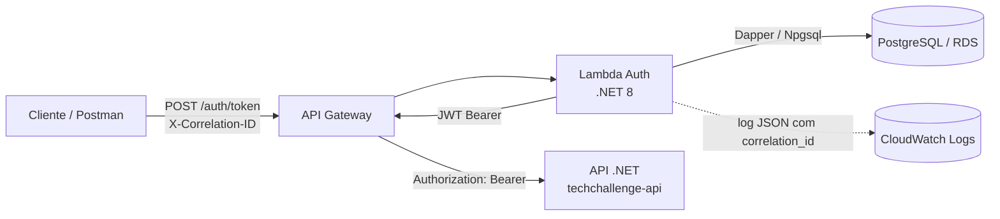
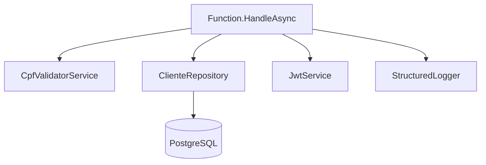

# Lambda Auth Function

Função serverless de autenticação por CPF do Tech Challenge. Ela é a porta de entrada
do fluxo autenticado: valida o CPF, confirma que o cliente existe e está ativo no banco
e emite o JWT usado pela API .NET do repositório
[fase1-tech-challenge](https://github.com/SOAT-FIAP-2026/fase1-tech-challenge).

O cliente nunca acessa o banco diretamente. O segredo de assinatura e a string de
conexão chegam por variáveis de ambiente da Lambda, alimentadas por Secrets Manager/SSM
no ambiente de deploy.

## Responsabilidade

- validar formato e dígitos verificadores do CPF (`CpfValidatorService`);
- consultar existência e situação do cliente no PostgreSQL (`ClienteRepository`);
- rejeitar cliente inexistente ou inativo (coluna `ApagadoEm` preenchida);
- emitir JWT HMAC-SHA256 com `sub`, `jti`, `cpf`, `iss`, `aud` e expiração (`JwtService`);
- propagar `X-Correlation-ID` e emitir log JSON correlacionado (`StructuredLogger`);
- ser chamada pelo API Gateway antes das rotas protegidas da API.

## Arquitetura



Componentes internos:



## Tecnologias utilizadas

| Camada | Tecnologia |
|---|---|
| Runtime | .NET 8 (`dotnet8` na AWS Lambda) |
| Handler | `Amazon.Lambda.APIGatewayEvents`, `Amazon.Lambda.Core` |
| Serialização | `Amazon.Lambda.Serialization.SystemTextJson` |
| Acesso a dados | Dapper 2.1 + Npgsql 8 (PostgreSQL) |
| Token | `System.IdentityModel.Tokens.Jwt` + `Microsoft.IdentityModel.Tokens` (HMAC-SHA256) |
| Testes | xUnit, FluentAssertions, NSubstitute |
| Infraestrutura | Terraform — Lambda, IAM, Security Group, CloudWatch e API Gateway HTTP |
| CI | GitHub Actions — build, testes com cobertura e SonarQube Cloud ([build.yml](.github/workflows/build.yml)) |
| CD | GitHub Actions — empacota e aplica o Terraform ([cd.yml](.github/workflows/cd.yml)) |
| Observabilidade | Log JSON em CloudWatch Logs, correlacionado por `X-Correlation-ID` |

## Contrato da API

`POST /auth/token`

Request:

```json
{
  "cpf": "529.982.247-25"
}
```

O CPF aceita máscara; ele é normalizado para 11 dígitos antes da consulta.

Response `200`:

```json
{
  "access_token": "<jwt>",
  "token_type": "Bearer",
  "expires_in": 3600
}
```

| Status | Quando |
|---|---|
| `200` | CPF válido e cliente ativo — token emitido |
| `400` | body vazio/inválido, CPF com formato ou dígito verificador inválido |
| `401` | cliente inexistente ou inativo |
| `500` | falha interna (banco indisponível, configuração ausente) |

Toda resposta devolve o header `X-Correlation-ID`. Se o chamador enviar o header
(até 128 caracteres), o mesmo valor é reaproveitado; caso contrário é usado o
`AwsRequestId` da invocação.

### Coleção de testes

- Collection Postman: [`docs/postman/lambda-auth.postman_collection.json`](docs/postman/lambda-auth.postman_collection.json)
- Swagger da API principal: `http://localhost:8080/swagger` em execução local; rota
  `/swagger` no Load Balancer após o deploy.

Esta função é um único endpoint e não publica Swagger próprio: o contrato acima e a
collection Postman são a documentação oficial dela.

## Variáveis e Parâmetros (AWS SSM Parameter Store)

A função recupera todas as suas configurações dinamicamente no cold start a partir do **AWS SSM Parameter Store** (com cache em memória e decodificação KMS):

| Parâmetro SSM | Variável de Ambiente (Fallback Local) | Descrição |
|---|---|---|
| `/techchallenge/prod/db_connection_string` | `DB_CONNECTION_STRING` | Conexão Npgsql para o PostgreSQL/RDS |
| `/techchallenge/prod/jwt_secret` | `JWT_SECRET` | Chave HMAC de no mínimo 32 caracteres |
| `/techchallenge/prod/jwt_issuer` | `JWT_ISSUER` | Claim `iss` (padrão: `TechChallenge`) |
| `/techchallenge/prod/jwt_audience` | `JWT_AUDIENCE` | Claim `aud` (padrão: `techchallenge.com.br`) |
| `/techchallenge/prod/jwt_expires_in_seconds` | `JWT_EXPIRES_IN_SECONDS` | Validade do token em segundos (padrão: `3600`) |

Nenhum segredo precisa ser versionado nem mantido nos secrets do repositório: os parâmetros são mantidos centralmente no SSM e provisionados pelo bootstrap de [soat-infra](https://github.com/SOAT-FIAP-2026/soat-infra).

## Execução Local

Pré-requisitos: .NET SDK 8 e `Amazon.Lambda.Tools`.

```bash
# restaurar e compilar
dotnet restore
dotnet build

# rodar os testes
dotnet test

# ferramenta de empacotamento
dotnet tool install -g Amazon.Lambda.Tools
```

Invocação local com o Mock Lambda Test Tool:

```bash
dotnet tool install -g Amazon.Lambda.TestTool-8.0
dotnet lambda-test-tool-8.0
```

Para execução local, você pode definir as variáveis de ambiente acima diretamente na sua máquina; o handler é:
`Fiap.TechChallenge.LambdaAuth::Fiap.TechChallenge.LambdaAuth.Function::HandleAsync`.

## Deploy e Infraestrutura

A infraestrutura desta função (IAM Role, CloudWatch Log Group, VPC/Security Group e API Gateway HTTP) é gerenciada centralmente em [soat-infra](https://github.com/SOAT-FIAP-2026/soat-infra) através dos módulos `modules/lambda` e `modules/api_gateway`.

### CI/CD (GitHub Actions)

- **CI ([build.yml](.github/workflows/build.yml))**: Executa a cada push e PR, realizando restore, build, testes e análise de qualidade no SonarQube Cloud.
- **CD ([cd.yml](.github/workflows/cd.yml))**: Executa a cada push em `main`, empacota a aplicação via `dotnet lambda package`, publica o `.zip` no bucket S3 permanente (`soat-fiap-backend-tfstate/lambda/auth/lambda-auth.zip`) e atualiza o código da Lambda na AWS se a infraestrutura estiver ativa.

Secrets necessários (nível de organização ou repositório):

| Nome | Tipo | Descrição |
|---|---|---|
| `ACCESS_KEY_ID` (ou `AWS_ACCESS_KEY_ID`) | secret | Chave de acesso da AWS |
| `ACCESS_KEY_SECRET` (ou `AWS_SECRET_ACCESS_KEY`) | secret | Chave secreta da AWS |
| `ACCESS_SESSION_TOKEN` (ou `AWS_SESSION_TOKEN`) | secret | Token de sessão da AWS (opcional) |

### Deploy manual sem Terraform

Empacotamento:

```bash
cd src/Fiap.TechChallenge.LambdaAuth
dotnet lambda package --configuration Release --framework net8.0 --output-package lambda-auth.zip
```

Publicação (ajuste nome, role e região do ambiente):

```bash
aws lambda create-function \
  --function-name techchallenge-lambda-auth \
  --runtime dotnet8 \
  --role arn:aws:iam::<conta>:role/<role-de-execucao> \
  --handler "Fiap.TechChallenge.LambdaAuth::Fiap.TechChallenge.LambdaAuth.Function::HandleAsync" \
  --zip-file fileb://lambda-auth.zip \
  --timeout 30 --memory-size 512

# atualizações seguintes
aws lambda update-function-code \
  --function-name techchallenge-lambda-auth \
  --zip-file fileb://lambda-auth.zip
```

A função precisa rodar nas subnets privadas da VPC criada em
[soat-infra](https://github.com/SOAT-FIAP-2026/soat-infra) para alcançar o RDS de
[soat-db](https://github.com/SOAT-FIAP-2026/soat-db), com um Security Group liberado na
porta 5432.

### Pendente

Não há endpoint publicado: o deploy depende de credenciais AWS e da VPC de soat-infra
estarem disponíveis. Assim que o CD rodar, a URL sai no output `auth_endpoint` e deve
substituir o `baseUrl` da collection Postman.

## Observabilidade

Cada invocação emite uma linha JSON no CloudWatch Logs:

```json
{
  "Timestamp": "2026-09-13T12:00:00.000Z",
  "LogLevel": "Information",
  "Message": "Token emitido com sucesso.",
  "service": "techchallenge-lambda-auth",
  "correlation_id": "abc-123",
  "aws_request_id": "3f9b...",
  "duration_ms": 42.7,
  "status_code": 200,
  "outcome": "success"
}
```

O formato acompanha o `AddJsonConsole` da API .NET, então `correlation_id` permite
seguir a mesma requisição da Lambda até a API no Grafana/Loki ou no CloudWatch.
CPF, nome e e-mail nunca são registrados.

Falhas de autenticação saem como `LogLevel: "Warning"` com o campo `outcome`
(`invalid_body`, `invalid_cpf`, `unauthorized_client`); falhas internas saem como
`Error` com `exception_type`, `exception_message` e `exception_stack`.

## Estrutura do repositório

```
lambda-auth-function/
├── src/Fiap.TechChallenge.LambdaAuth/
│   ├── Function.cs                   # Handler do API Gateway
│   ├── Models/                       # AuthRequest, AuthResponse
│   ├── Services/                     # CpfValidator, ClienteRepository, JwtService
│   ├── Exceptions/                   # CpfInvalido, ClienteNaoAutorizado
│   └── Observability/StructuredLogger.cs
├── tests/Fiap.TechChallenge.LambdaAuth.Tests/
├── infra/                            # Terraform: Lambda, IAM, API Gateway, logs
└── docs/postman/
```

## Repositórios relacionados

- [fase1-tech-challenge](https://github.com/SOAT-FIAP-2026/fase1-tech-challenge) — API .NET, Swagger e dashboards
- [soat-infra](https://github.com/SOAT-FIAP-2026/soat-infra) — EKS, VPC e stack de observabilidade
- [soat-db](https://github.com/SOAT-FIAP-2026/soat-db) — RDS PostgreSQL
