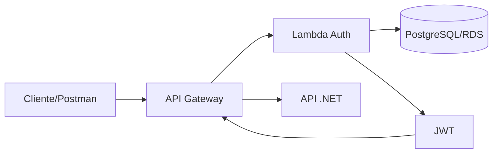

# Lambda Auth Function

Repositório reservado para a função serverless de autenticação do Tech Challenge.
O repositório foi criado no GitHub, mas ainda não contém uma implementação funcional
da Lambda. Este README registra o contrato e o desenho esperado para que a implementação
possa ser desenvolvida sem confundir arquitetura planejada com componente entregue.

## Responsabilidade

A função deverá:

- validar o formato e os dígitos verificadores do CPF;
- consultar a existência e a situação do cliente no banco;
- rejeitar cliente inexistente ou inativo;
- emitir JWT com expiração, issuer, audience e subject definidos;
- ser chamada pelo API Gateway/authorizer antes das rotas protegidas.

## Arquitetura planejada



O banco não deve ser acessado diretamente pelo cliente. Segredos, chave de assinatura
e conexão devem ser fornecidos por Secrets Manager/SSM ou mecanismo equivalente do
ambiente de deploy.

## Contrato esperado

`POST /auth/token`

Request:

```json
{
  "cpf": "00000000000"
}
```

Response `200`:

```json
{
  "access_token": "<jwt>",
  "token_type": "Bearer",
  "expires_in": 3600
}
```

Respostas esperadas: `400` para CPF inválido, `401` para cliente inexistente/inativo
e `500` para falhas internas. O contrato deverá ser atualizado quando a implementação
for criada.

## Tecnologias previstas

- AWS Lambda;
- API Gateway ou Lambda Authorizer;
- PostgreSQL/RDS;
- JWT;
- Terraform para infraestrutura;
- GitHub Actions para CI/CD;
- testes unitários e de contrato.

## Execução e deploy

Ainda não há código, Dockerfile, Terraform, pipeline ou endpoint ativo neste repositório.
Quando a implementação começar, incluir neste README:

1. comandos de instalação e testes;
2. variáveis de ambiente sem valores secretos;
3. comando de empacotamento da Lambda;
4. pipeline de homologação e produção;
5. link do endpoint publicado e do Swagger/Postman.

## APIs relacionadas

- Swagger local da aplicação principal: http://localhost:8080/swagger
- Contrato desta função: pendente de implementação e publicação.

## Estado

Este arquivo atende à documentação inicial do repositório. A função e sua integração
com o Gateway continuam pendentes e estão registradas no relatório integrado em
[fase1-tech-challenge/docs/validation-report.md](https://github.com/SOAT-FIAP-2026/fase1-tech-challenge/blob/main/docs/validation-report.md).
